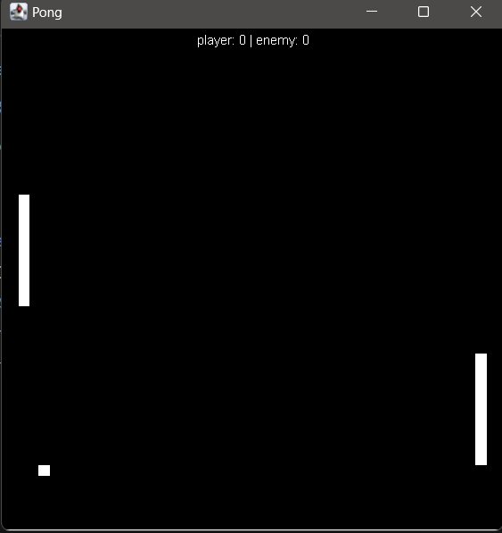

# Pong em Java

Uma implementação simples do clássico jogo Pong utilizando Java. Este projeto foi criado para demonstrar o uso de Java para criar jogos simples com uma interface gráfica.

## Funcionalidades

- **Modo de Jogo singleplayer**: Apenas um jogador contra o inimigo.
- **Controle Simples**: O jogador pode controlar sua raquete usando as teclas 'w' e 's'.
- **Pontuação**: O jogo mantém a pontuação tanto do inimigo quanto do player.
- **Jogo infinito**: Por enquanto, o jogo é infinito.

## Preview do jogo

<div style="text-align: center">
    
</div>

## Como rodar?

Basta entrar na pasta do projeto e colocar o seguinte comando: </br></br>

```sh
java PongGame
```
